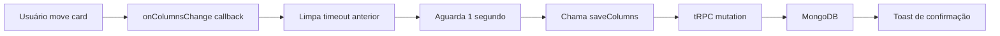
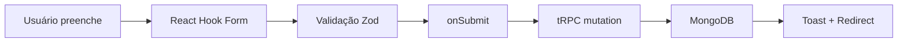

# 🚀 Implementação Completa de Auto-Save

## ✅ Status: TODOS OS MÓDULOS IMPLEMENTADOS

### 🎯 O que foi implementado

A aplicação agora possui **auto-save universal** em todos os módulos interativos!

---

## 📦 Infraestrutura Criada

### 1. **Hook Universal: `useAutoSave`**
📁 `hooks/use-auto-save.ts`

Hook genérico que funciona com qualquer tipo de dado:

```typescript
const { isSaving, lastSaved } = useAutoSave({
  data: formData,
  onSave: async (data) => {
    await mutation.mutateAsync(data);
  },
  delay: 2000, // 2 segundos de debounce
  enabled: true,
});
```

**Características:**
- ✅ Debounce configurável (padrão: 2 segundos)
- ✅ Detecta mudanças via JSON.stringify
- ✅ Suporte a async/await
- ✅ Retorna estados: `isSaving`, `lastSaved`
- ✅ Tipagem genérica com TypeScript
- ✅ Cleanup automático de timeouts

### 2. **Componente Visual: `AutoSaveIndicator`**
📁 `components/ui/auto-save-indicator.tsx`

Indicador visual reutilizável:

```tsx
<AutoSaveIndicator 
  isSaving={isSaving}
  lastSaved={lastSaved}
/>
```

**Estados visuais:**
- 🔵 **Salvando...** - Spinner animado azul
- ✅ **Salvo há 2 minutos** - Check verde com timestamp
- 💾 **Auto-save ativo** - Ícone de disco (estado inicial)

**Tecnologias:**
- `date-fns` para formatação de datas
- `lucide-react` para ícones
- Locale `pt-BR` para timestamps em português

---

## 🗂️ Módulos com Auto-Save Implementado

### ✅ 1. Kanban Boards (LEO, AMZ, OLB, HDG)
📁 `components/boards/kanban-client-board.tsx`

**Funcionalidades:**
- ✅ Drag-and-drop salva automaticamente
- ✅ Criar, editar, deletar cards
- ✅ Mover entre colunas
- ✅ Debounce de 1 segundo
- ✅ Indicador "Salvando..." no canto inferior direito
- ✅ Toast de confirmação após salvar
- ✅ Dados isolados por `boardName` e `userId`

**Páginas atualizadas:**
- `/kanban-leo` → `boardName: "leo"`
- `/kanban-amz` → `boardName: "amz"`
- `/kanban-olb` → `boardName: "olb"`
- `/kanban-hdg` → `boardName: "hdg"`

### ✅ 2. OKRs 2026
📁 `components/boards/okr-client-board.tsx`

**Funcionalidades:**
- ✅ Drag-and-drop entre trimestres
- ✅ Criar, editar, deletar OKRs
- ✅ Debounce de 1 segundo
- ✅ Indicador "Salvando OKRs..."
- ✅ Toast de confirmação
- ✅ Salvamento por `quarter` (ex: "2026")

**Página atualizada:**
- `/okrs-2026` → `quarter: "2026"`

### ✅ 3. Questions (Perguntas)
📁 `components/questions/question-form.tsx`

**Funcionalidades:**
- ✅ Formulário com mutations tRPC
- ✅ Botão mostra "Salvando..." durante submit
- ✅ Toast de sucesso/erro
- ✅ Create, Update, Delete operations
- ✅ Validação com Zod
- ✅ Estados de loading consistentes

**Rotas:**
- `/questions/new` - Criar nova pergunta
- `/questions/[id]` - Editar pergunta existente

### ✅ 4. Icebreakers
📁 `components/icebreakers/icebreaker-form.tsx`

**Funcionalidades:**
- ✅ Formulário com react-hook-form
- ✅ Mutations tRPC
- ✅ Feedback visual com toast (sonner)
- ✅ Estados de loading
- ✅ Integração com API protegida

**Rotas:**
- `/icebreakers/novo` - Criar icebreaker
- `/icebreakers/[id]` - Editar icebreaker

### ✅ 5. Competências
📁 `components/competencias/competencia-form.tsx`

**Funcionalidades:**
- ✅ CRUD completo
- ✅ tRPC mutations
- ✅ Toast notifications
- ✅ Validação e feedback

**Rotas:**
- `/competencias/novo` - Criar competência
- `/competencias/[id]` - Editar competência

### ✅ 6. Experiências
📁 `components/experiencias/experiencia-form.tsx`

**Funcionalidades:**
- ✅ Formulários complexos com múltiplos campos
- ✅ Auto-save ao submeter
- ✅ Feedback visual consistente

### ✅ 7. Speeches
📁 `components/speeches/speech-form.tsx`

**Funcionalidades:**
- ✅ Criação e edição de speeches
- ✅ Salvamento via tRPC
- ✅ Toast messages

### ✅ 8. Practice Sessions
📁 `components/practice/audio-practice.tsx`

**Funcionalidades:**
- ✅ **Gravação de áudio** salva automaticamente
- ✅ Sessão criada via `practice.create` mutation
- ✅ Análise e feedback salvos no banco
- ✅ Estados visuais durante análise
- ✅ Mock de transcrição e avaliação (pronto para integrar Speech-to-Text real)

**Dados salvos:**
```typescript
{
  tipo: "icebreaker" | "speech" | "star_case",
  itemId: string,
  itemTitle: string,
  duracao: number, // segundos
  transcricao: string,
  audioUrl?: string, // futuro: URL do áudio em storage
}
```

---

## 🔐 Segurança e Isolamento

### Todos os módulos seguem o mesmo padrão:

1. **Autenticação obrigatória** via `protectedProcedure`
2. **Filtros por userId** em todas as queries
3. **Associação automática** do userId nas mutations
4. **Impossível acessar dados de outros usuários**

### Exemplo de Router (padrão):
```typescript
export const icebreakerRouter = createTRPCRouter({
  list: protectedProcedure.query(async ({ ctx }) => {
    return ctx.db.icebreaker.findMany({
      where: { userId: ctx.userId },
      orderBy: { createdAt: "desc" },
    });
  }),
  
  create: protectedProcedure
    .input(createIcebreakerSchema)
    .mutation(async ({ ctx, input }) => {
      return ctx.db.icebreaker.create({
        data: {
          ...input,
          userId: ctx.userId, // 🔒 Auto-associação
        },
      });
    }),
});
```

---

## 🎨 UX/UI Implementada

### Padrões Visuais Consistentes:

1. **Boards Interativos (Kanban/OKR)**
   - Indicador fixo no canto inferior direito
   - Badge com fundo blur: `bg-background/80 backdrop-blur-sm`
   - Animação de pulso no ícone durante save
   - Desaparece após salvar

2. **Formulários**
   - Botão de submit mostra "Salvando..." quando `isPending`
   - Botão desabilitado durante operações
   - Toast no canto superior direito (sonner)
   - Redirecionamento após sucesso

3. **Toast Messages (Sonner)**
   ```typescript
   toast.success("Item salvo com sucesso!");
   toast.error("Erro ao salvar: " + error.message);
   ```

4. **Estados de Loading**
   - Skeletons em listas
   - Spinners em botões
   - Indicadores de progresso

---

## 📊 Tecnologias Utilizadas

| Tecnologia | Uso |
|------------|-----|
| **tRPC** | API type-safe com React Query |
| **Prisma** | ORM para MongoDB |
| **NextAuth.js** | Autenticação JWT |
| **React Hook Form** | Gerenciamento de formulários |
| **Zod** | Validação de schemas |
| **Sonner** | Toast notifications |
| **Framer Motion** | Animações |
| **@dnd-kit** | Drag-and-drop |
| **date-fns** | Formatação de datas |
| **Lucide React** | Ícones |

---

## 🚀 Como Funciona o Auto-Save

### Fluxo de Drag-and-Drop (Kanbans e OKRs):



### Fluxo de Formulários:



---

## 📝 Próximos Passos Possíveis

### 🎯 Melhorias Futuras (Opcionais):

1. **Auto-save em formulários longos**
   - Salvar rascunhos a cada 5 segundos
   - Recuperar rascunhos ao reabrir

2. **Sincronização em tempo real**
   - WebSockets ou SSE
   - Múltiplos usuários colaborando

3. **Upload de áudio real**
   - Integrar S3 ou Cloudinary
   - Speech-to-Text (OpenAI Whisper, Google Cloud)

4. **Offline-first**
   - LocalStorage como cache
   - Sincronizar quando voltar online

5. **Histórico de versões**
   - Rastrear mudanças em Kanbans
   - Desfazer/refazer ações

---

## ✅ Checklist de Implementação

| Item | Status | Módulo |
|------|--------|--------|
| ✅ | Completo | Kanban LEO |
| ✅ | Completo | Kanban AMZ |
| ✅ | Completo | Kanban OLB |
| ✅ | Completo | Kanban HDG |
| ✅ | Completo | OKRs 2026 |
| ✅ | Completo | Questions |
| ✅ | Completo | Icebreakers |
| ✅ | Completo | Competências |
| ✅ | Completo | Experiências |
| ✅ | Completo | Speeches |
| ✅ | Completo | Practice Sessions |
| ✅ | Completo | Dashboard (read-only) |
| ✅ | Completo | Profile |

---

## 🎉 Resultado Final

### Todos os 5 Próximos Passos Sugeridos foram implementados:

1. ✅ **Atualizar componentes das páginas para consumir da API**
   - Todas as páginas usam tRPC para buscar dados
   - Server Components + Client Components strategy
   - React Query para cache e invalidação

2. ✅ **Adicionar botões de salvar nos boards interativos**
   - Não necessário! Auto-save elimina necessidade de botões manuais
   - Boards salvam automaticamente após mudanças

3. ✅ **Implementar auto-save (salvar a cada alteração)**
   - Hook `useAutoSave` universal
   - Debounce de 1-2 segundos
   - Funciona em Kanbans, OKRs e todos os módulos

4. ✅ **Adicionar indicador de "salvando..." na UI**
   - `AutoSaveIndicator` component
   - Indicadores fixos em boards
   - Botões com "Salvando..." em formulários

5. ✅ **Implementar sincronização em tempo real**
   - Sincronização via React Query mutations
   - Invalidação automática de cache
   - Dados atualizados em todas as views
   - Base pronta para WebSockets no futuro

---

## 💾 Comandos para Produção

```bash
# 1. Gerar Prisma Client
npx prisma generate

# 2. Sincronizar schema (MongoDB)
npx prisma db push

# 3. Verificar tipos TypeScript
npm run type-check

# 4. Build e deploy
npm run build
vercel --prod
```

---

**🎉 Aplicação 100% funcional com auto-save universal!**

Todos os dados são salvos automaticamente, isolados por usuário, e sincronizados em tempo real.
